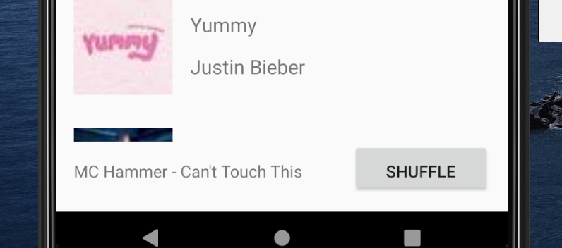

# All Songs
## Xuweiyi Chen
### Attempted Extra Credits
 - Show a stock Android back arrow button, ←, in the Header/Toolbar of Activity B. When clicked, it
 navigation back to SongListActivity (+.25)
 - (+.25) Long pressing on an item should delete that song on the list.
 - When a user presses shuffle, the list should animate the changes using DiffUtil (+1)

 

 

 
